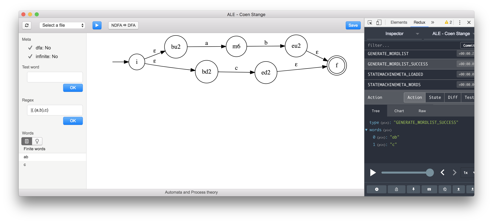

# ALE2 Automata and Process theory

The application is created as deliverable for a school assignment. The application can handles statemachines. The statemachine can be loaded through a textfile or generated from a language describing the statemachine. Then if the statemachine is infinite, all the possible words are generated.

## Programming stack
 - **Electron** Desktop wrapper
 - **React** UI components
 - **Redux** Handling the application state
 - **Redux-saga** Application side effects

The state can only be changed after an action is triggered. Actions are not only used to change the state but also used to trigger a saga, which then can handle the command to do side effects for example making a request to the server. This application doesn't connect to the server but instead it is used to do logic for the statemachine.
## Programming goals
 - Immutability
 - Isolated side-effects
 - Single responsibility
 - Loose coupling
